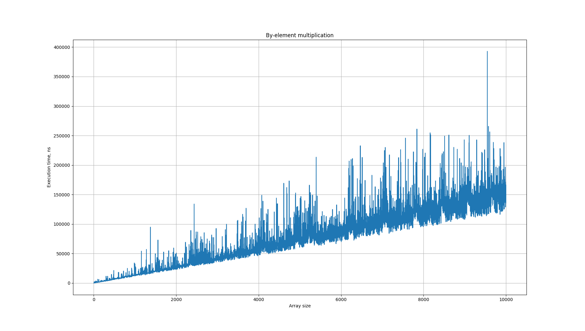
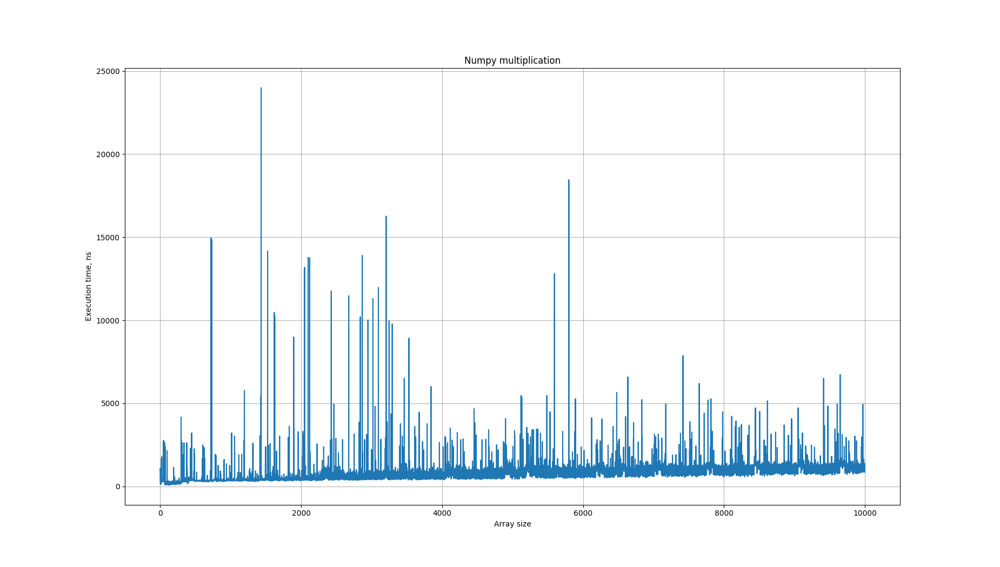
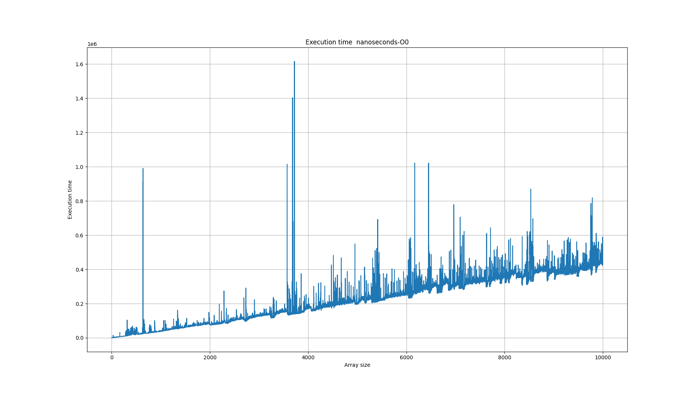
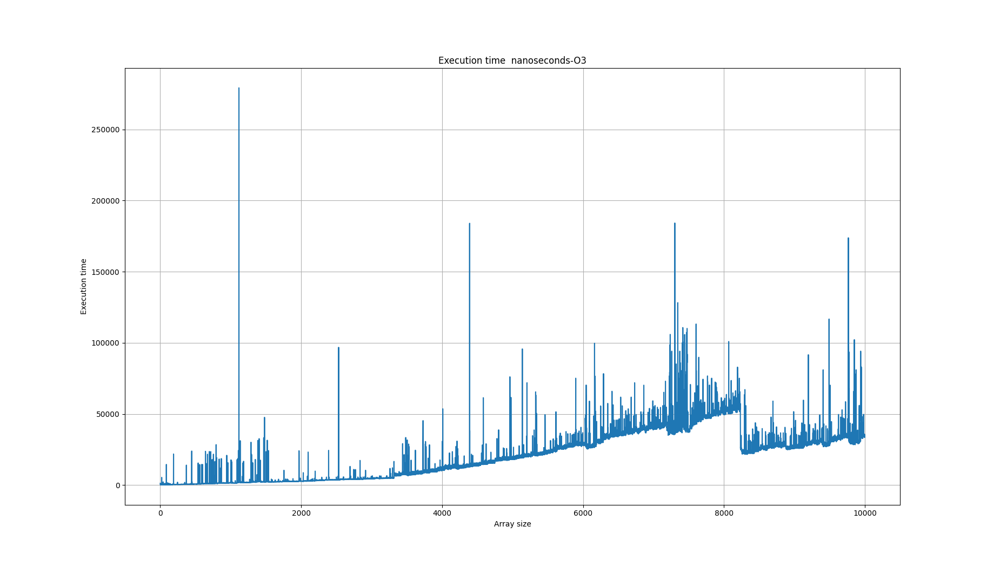

# Homework 2. Vectorization

## Experiment setup

Run and measure execution time for different size arrays. Maximum array size is 10000.

## Python

### Element-wise multiplication



Graph has a linear trend.

### Numpy multiplication



Graph also has a linear trend but the line coefficient is much smaller than in element-wise multiplication.

## C++

### O-0 optimization

Command line

```bash
cmake -DCMAKE_CXX_FLAGS="-O0" .
cmake --build .
```



Graph has a linear trend.

### O-3 optimization

Command line

```bash
cmake -DCMAKE_CXX_FLAGS="-O3" .
cmake --build .  
```



Graph is piece-wise, exponential.

### Intristics

## Conclusion
