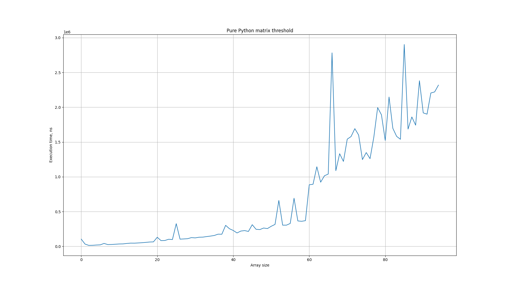
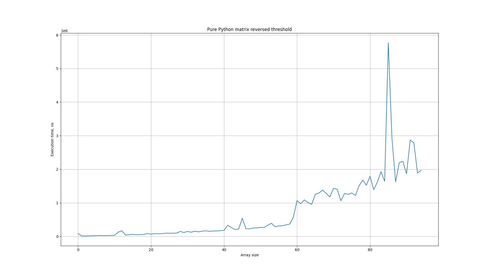
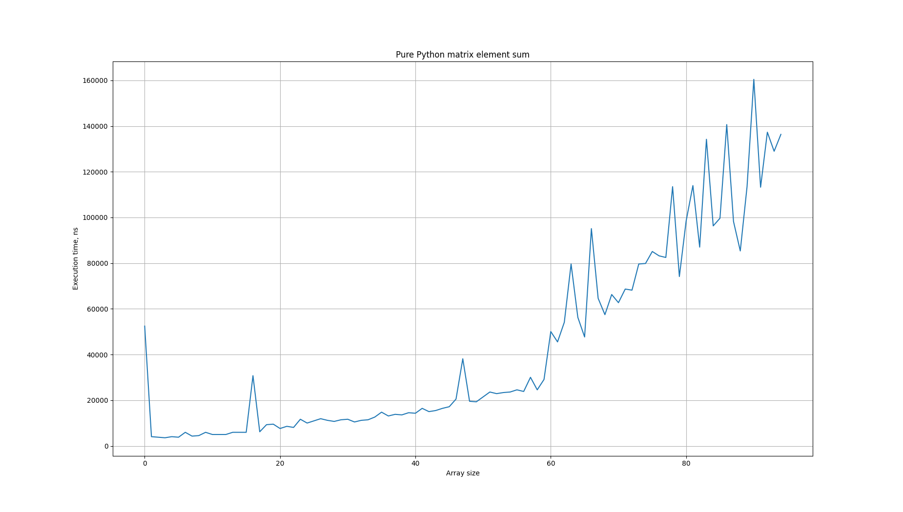
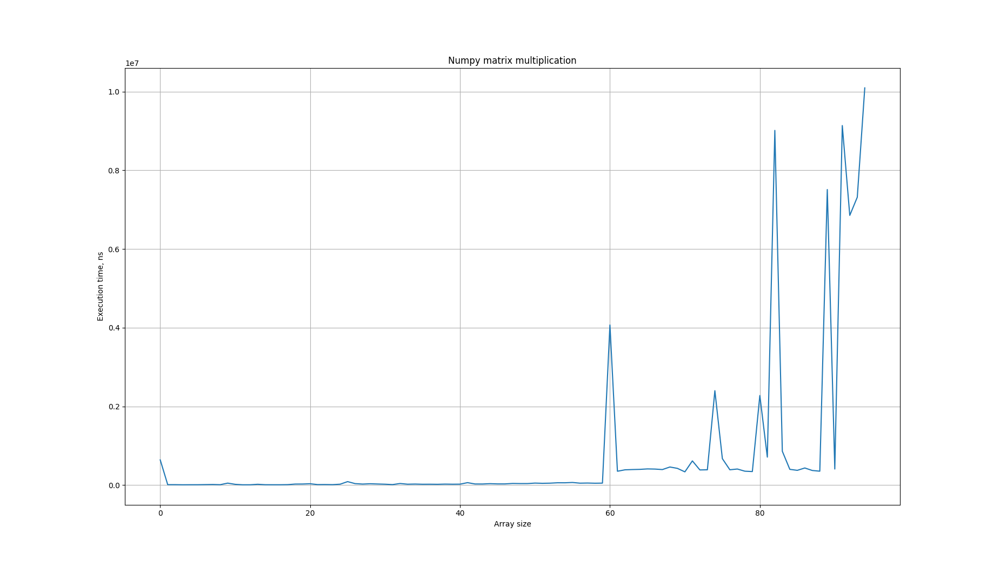
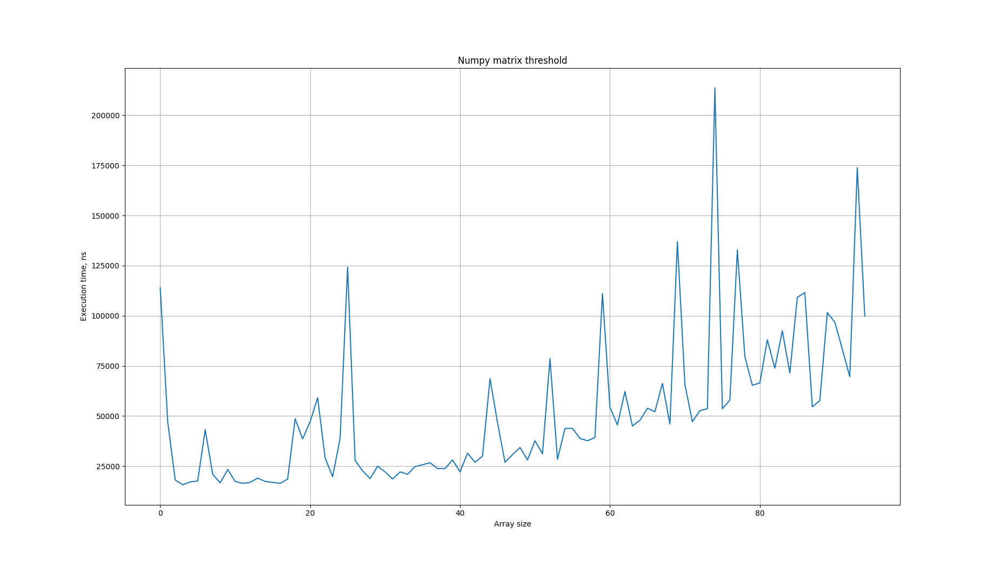
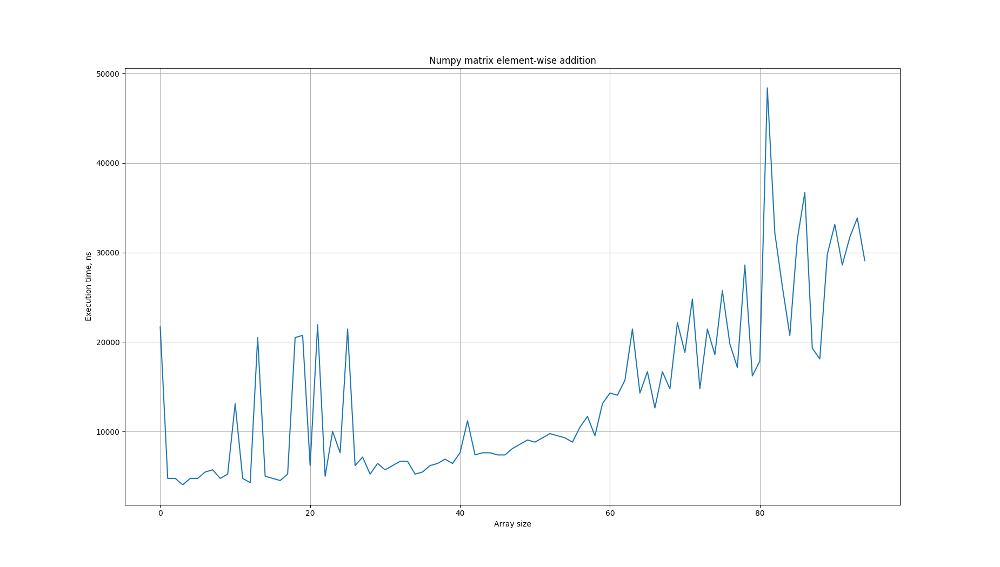

# Homework 3. Python extention with C/C++

## A. Create program with pure Python (without Numpy)

### Description

- Two square matrixes are multiplied
- Threshold of the matrix
  - if value <= threshold 1
  - 0 otherwise
- Threshold of the matrix reversed
  - if value <= threshold 0
  - 1 otherwise
- Sum element-wise two matrixes
- Find sum of all elements in the matrix

### Results

## B. Create program with Numpy for the same operations as in task A

### Results

## C. Create program with Python extension for the same operations as in task A

### Results

### Comparison

## D. Demonstrate conditions for Python extension will be faster than Numpy

## Conclusion
